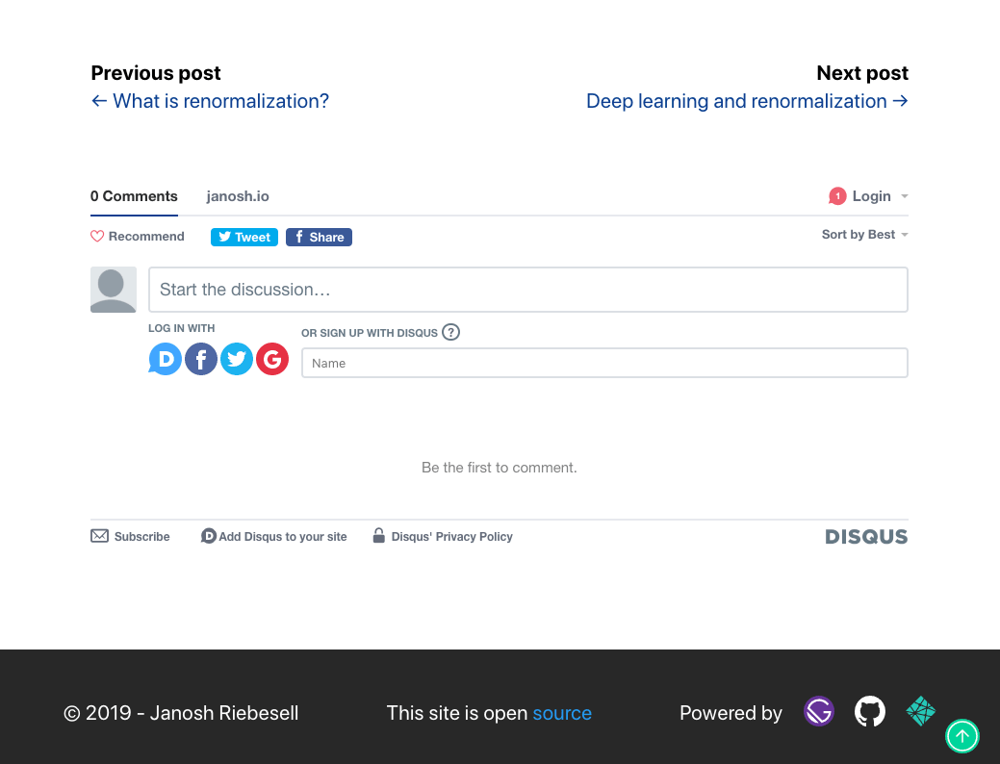

If you're using Gatsby to run a blog and you've started adding some content to it, the next thing to think about is how to increase engagement among your visitors. A great way to do that is to allow them to ask questions and express their views on what you've written. This will make your blog seem much more lively to anyone visiting it.

There are many options out there for adding comment functionality to a site, several of them specfically targeted at static sites. So the hardest part may be to choose which one to go with. With no claims on completeness, here's a list of available services:

- [Disqus](https://disqus.com)
- [Facebook comments](https://www.npmjs.com/package/react-facebook)
- [Staticman](https://staticman.net)
- [JustComments](https://just-comments.com)
- [TalkYard](https://www.talkyard.io)
- [Gitalk](https://gitalk.github.io)

All of the above are excellent options worth checking out. Staticman, for instance, took an interesting approach. Essentially, you set up your own HTML form for writing comments, let it send a POST request on submission to one of their endpoints. From this Staticman will automatically submit a pull request to your site's repo which you can accept or deny. This has the big advantage of keeping everything static (hence the name). All your data is in one place (your repo) as opposed to having to be loaded through JavaScript embeds or iframes on the fly. It will remain there even if Staticman is ever discontinued. With most other services, you depend on an external platform to deliver your comments. Of course, in return you have the increased manual setup of putting together the comment form and hooking it up to Staticman. Depending on your use case, this degree of customizability might be an advantage.

But in this guide, we'll assume you want something fast with as little manual configuration and setup as possible. Disqus has several things going for it in this regard:

- It [seems to be by far the most widely used service](https://www.datanyze.com/market-share/comment-systems/disqus-market-share).
- It is low maintenance, meaning [moderating your comments and maintaining your forum](https://help.disqus.com/moderation/moderating-101) is easy.
- It provides official [React support](https://github.com/disqus/disqus-react).
- It offers a [generous free tier](https://disqus.com/pricing).
- It’s easy to comment: Disqus has a large existing user base and the onboarding experience for new users is fast since you can register with your Google, Facebook or Twitter account. You can also easily share your review about the post through those channels.
- Its commenting interface has a distinct but unobtrusive look that many users will instantly recognize and trust.
- All Disqus components are lazy-loaded, meaning they won't negatively impact the load times of your posts.

## Implementing Disqus


Here are the steps for adding Disqus comments to your own blog:

1. [Sign-up to Disqus](https://disqus.com/profile/signup). During the process you'll have to choose a shortname for your site. This is how Disqus will identify comments coming from your site. Copy that for later.
2. Install the Disqus React package

   ```sh
   yarn add disqus-react
   ```

3. Add the shortname from step 1 as something like `GATSBY_DISQUS_NAME` to your `.env` and `.env.example` files so that people forking your repo will know that they need to supply this value to get comments to work. (You need to prefix the environment variable with `GATSBY_` in order to [make it available to client side code](https://www.gatsbyjs.org/docs/environment-variables/#client-side-javascript).)
   ```:envtitle=.env.example
   ...
   # enables Disqus comments for blog posts
   GATSBY_DISQUS_NAME=insertValue
   ```
   ```:envtitle=.env
   ...
   GATSBY_DISQUS_NAME=yourOwnSiteShortname
   ```
4. In your blog post template (usually `src/templates/post.js`) import the `DiscussionEmbed` React component.

   ```js{3}:title=src/templates/post.js
   import React from 'react'
   import { graphql } from 'gatsby'
   import { DiscussionEmbed } from 'disqus-react'
   ...
   ```

   Then define your Disqus configuration object

   ```js
   const disqusConfig = {
     shortname: process.env.GATSBY_DISQUS_NAME,
     config: { identifier: slug, title },
   }
   ```

   where `identifier` must be a string or number that uniquely identifies the post. It could be the post's slug, title or some ID. Finally, add `DiscussionEmbed` to the JSX of your post template.

   ```jsx{6}:title=src/templates/post.js
   return (
     <Global>
       ...
       <PageBody>
         ...
         <DiscussionEmbed {...disqusConfig} />
       </PageBody>
     </Global>
   )
   ```

And you're done. You should now see the Disqus comment form appear beneath your blog post [looking like this](https://janosh.io/blog/disqus-comments#disqus_thread). Happy blogging!

[](https://janosh.io/blog/disqus-comments#disqus_thread)
